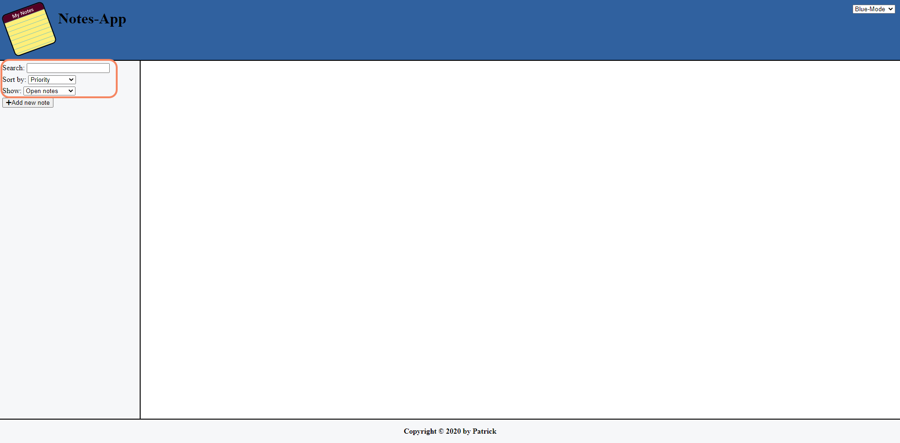
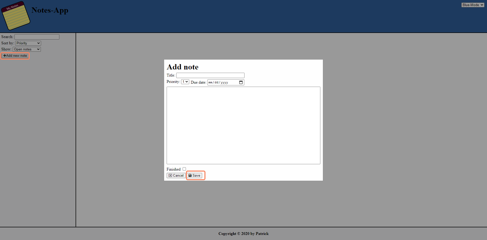
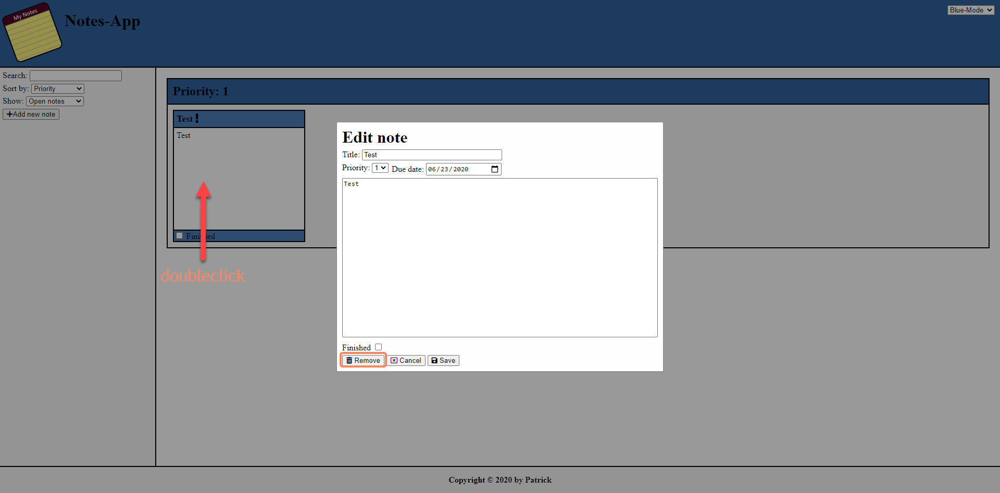
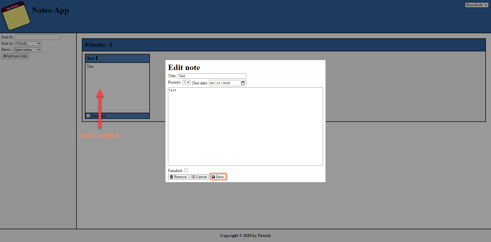
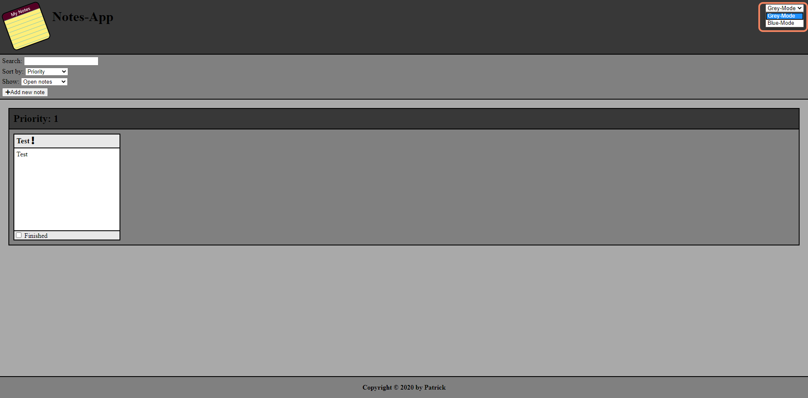

# CASFEE2020_PROJEKT-01
## Installation & Start of application
```bash
#Git SSH
git clone git@github.com:grazipa/CASFEE2020_Projekt-01.git

#Git HTTPS
git clone https://github.com/grazipa/CASFEE2020_Projekt-01.git

#Change dir
cd CASFEE2020_Projekt-01/

#Install packages
npm install

#Start application
npm start

#Server running at http://127.0.0.1:3001/
```

## Functions
### Filter & Sort notes
* Search \
Enter a word to search for and press `enter`.
* Sort by \
Choose how to sort the notes.
* Show \
Select the notes to be shown.



### Add note
Click `Add new note` and enter the needed data. \
For adding the note press `Save`.



### Remove note
`Doubleclick` the node and press `Remove`.



### Edit note
`Doubleclick` the node and press `Save` after editing the values.



### Change style
Selected the prefered style from the dropdown.

